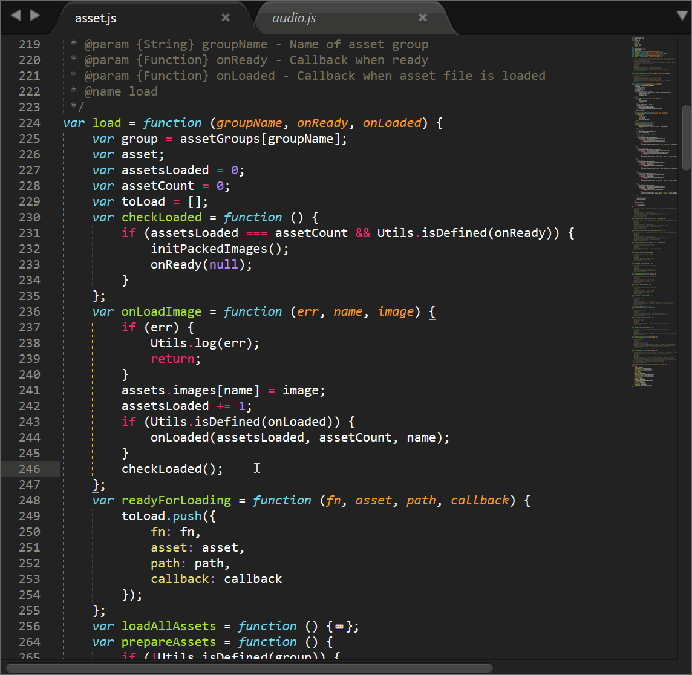

# Fold Javascript Functions 

A plugin for Sublime Text 3 for Javascript code. This plugin folds all functions except where your cursor is. This effectively removes all out-of-scope contexts, reducing a lot of noise while programming in JavaScript. 
Default shortcut key is ``cmd+alt+k``. (``ctrl+alt+k`` on Windows) 

## Additional features

There is an "Unfold All" command from the command palette. Furthermore, these options are available in the settings:

* ``select_to_unfold``: (on by default) One thing that annoys me in Sublime Text is to press that tiny triangle to unfold code. With this you can double click (which selects code) to open a folded block.
* ``fold_on_open``: (off by default) Folds upon opening a file.
* ``brace_selection``: (0 by default) Which part of the braces to fold. 0 = only inner content of braces, 1 = include braces, 2 = greedy inclusion (folds everything starting from the parameter list) 
* ``fold_constructors``: (off by default) The plugin will also fold object literal parameters inside constructors. For example: ``var myObj = new Constructor({...});``
* ``auto_fold``: (off by default) An experimental feature. Automatically folds and unfolds while you move your cursor.

Finally, the - admittedly unusual - Fold Args command (``cmd+alt+shift+k``) folds all function arguments in the selected code. This simplifies the view on the code and highlights the parts that are not yet "outsourced" to helper functions, which may give you some ideas for refactoring.

## Requirements

~~The functions must use 1TBS brace style, if the opening brace is on a new line, the functions won't be recognized.~~
All brace styles are supported.

Make sure you have the latest version of Sublime Text 3 installed. As of writing, build 3126.
The plugin makes use of Sublime's selectors to recognize the blocks with curly braces. Unfortunately, this keeps changing on every now and then (twice now since development of this plugin).

No support for Sublime Text 2, sorry.
